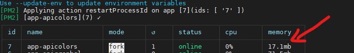
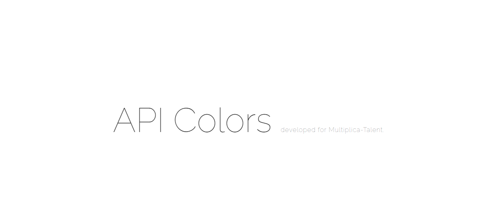
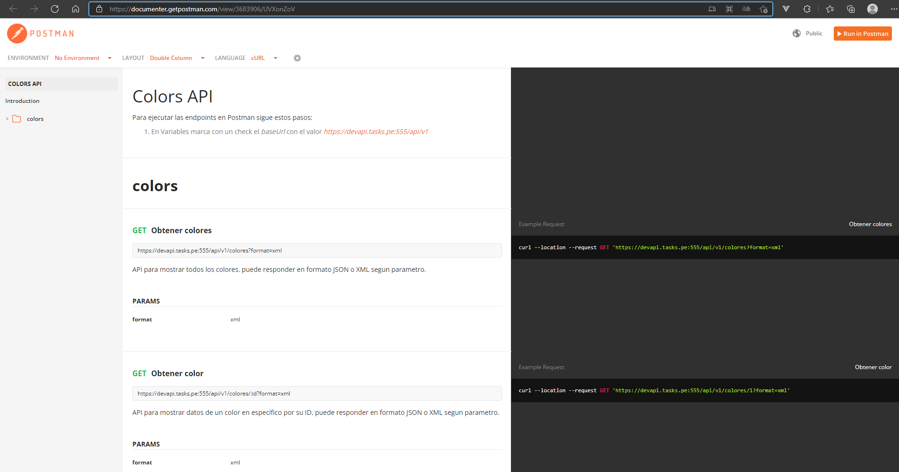

# api-colors
Consumir API de colores para tareas de community manager.

## Link API deployment
https://devapi.tasks.pe:555/

## Link POSTMAN published
https://documenter.getpostman.com/view/3683906/UVXonZoV

## File .env
Crea el archivo .env a partir del archivo .env.example

## Deployment
```bash
// Enviroment local
npm run watch

// Enviroment development server
pm2 start ecosystem.config.js --env development

// Enviroment production server
pm2 start ecosystem.config.js --env production
```

## Technologies
- nodejs
- express
- pm2

## Screenshots
Service nodejs running in PM2 <br/>


Web application nodejs deployed <br/>


Postman published <br/>

